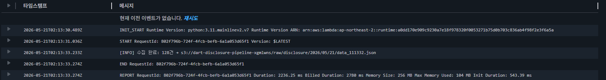
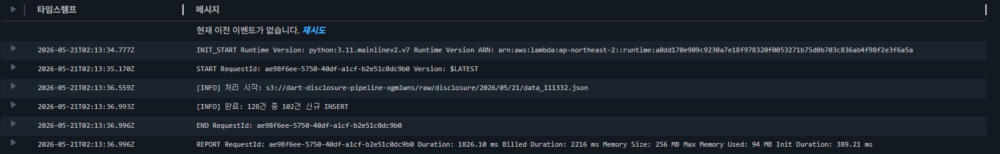
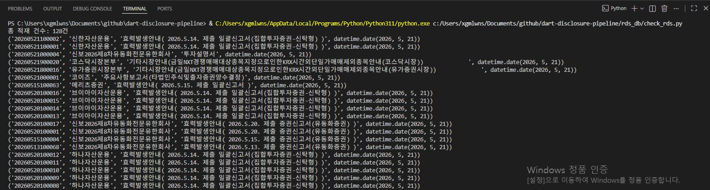
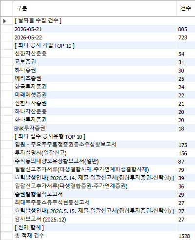
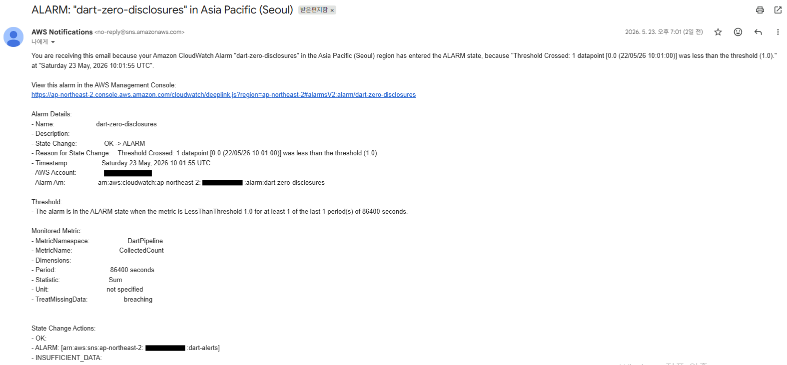

# DART Disclosure Data Pipeline

Automated pipeline for collecting disclosure data via DART OpenAPI (Financial Supervisory Service of Korea).
Ingests daily disclosure data through EventBridge → Lambda → S3 → RDS MySQL.

---

## Architecture

EventBridge (daily at 19:00 KST)
→ Lambda Collector (DART API → S3 raw/ storage)
→ Lambda Processor (S3 trigger → RDS MySQL INSERT)
CloudWatch Alarms → SNS → Email notification

---

## Stack

| Category | Technology |
|---|---|
| Language | Python 3.11 |
| Trigger | AWS EventBridge (cron) |
| Compute | AWS Lambda |
| Storage | AWS S3 (raw JSON) |
| Database | AWS RDS MySQL 8.0 (t3.micro) |
| Monitoring | AWS CloudWatch Alarms + SNS |
| Infra | AWS Lambda Layer (requests, pymysql) |

---

## Directory Structure

```text
dart-disclosure-pipeline/
├── lambda_collector/
│   └── handler.py         # DART API call → S3 storage
├── lambda_processor/
│   └── processor.py       # S3 trigger → RDS INSERT
├── rds_db/
│   ├── init_db.py         # Table DDL execution
│   └── check_rds.py       # Verify stored data
└── sns_alarm.py           # SNS alarm test + CloudWatch alarm setup
```

---

## Key Features

- **S3 Event Trigger decoupling**: Collector and Processor operate independently
- **Pagination handling**: Full DART API page traversal to ensure complete collection
- **INSERT IGNORE**: Prevents duplicate data insertion
- **CloudWatch custom metrics**: Alarm triggered when collected count is zero
- **SNS email alerts**: Automatic notification on error / duration exceeded / zero disclosures

---

## vs aws-stock-pipeline

| Category | aws-stock-pipeline | dart-disclosure-pipeline |
|---|---|---|
| Trigger | EventBridge | EventBridge + **S3 Event Trigger** |
| Storage | Simple S3 storage | S3 **raw layer** structure |
| Monitoring | None | **CloudWatch Alarms + custom metrics** |
| Alerts | None | **SNS email** |
| Data | Stock prices (numeric) | Disclosures (text, multi-ticker) |

---

## Results

### CloudWatch Log — Collector


### CloudWatch Log — Processor


### RDS Data Verification


---

### Collection Summary


> Collection period: 2026-05-21 ~ 2026-05-22 (2 days)  
> No disclosures on weekends (05/23–24) and public holiday (05/26).  
> CloudWatch zero-disclosures alarm triggered correctly — SNS email received.



---

## Local Setup

```bash
# Set environment variables
cp .env.example .env

# Initialize database
python rds_db/init_db.py

# Verify stored data
python rds_db/check_rds.py

# Create CloudWatch alarms
python scripts/create_alarms.py
```

---

## Environment Variables

| Key | Description |
|---|---|
| `DART_API_KEY` | DART OpenAPI authentication key |
| `S3_BUCKET` | S3 bucket name |
| `RDS_HOST` | RDS endpoint |
| `RDS_USER` | Database username |
| `RDS_PASSWORD` | Database password |
| `RDS_DB` | Database name |
| `SNS_ARN` | SNS topic ARN |